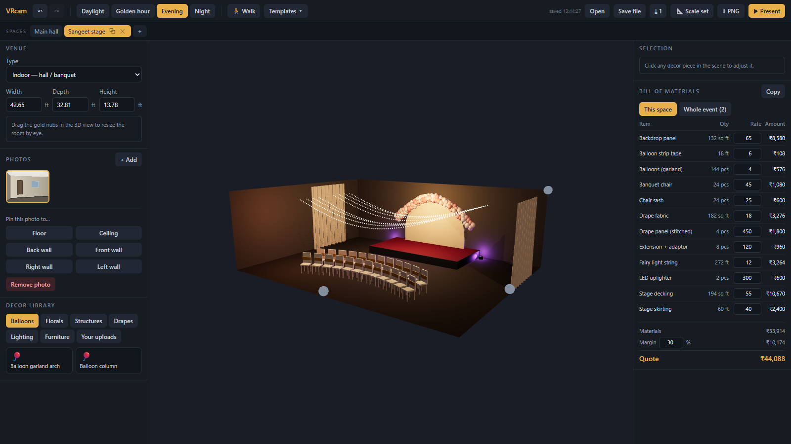
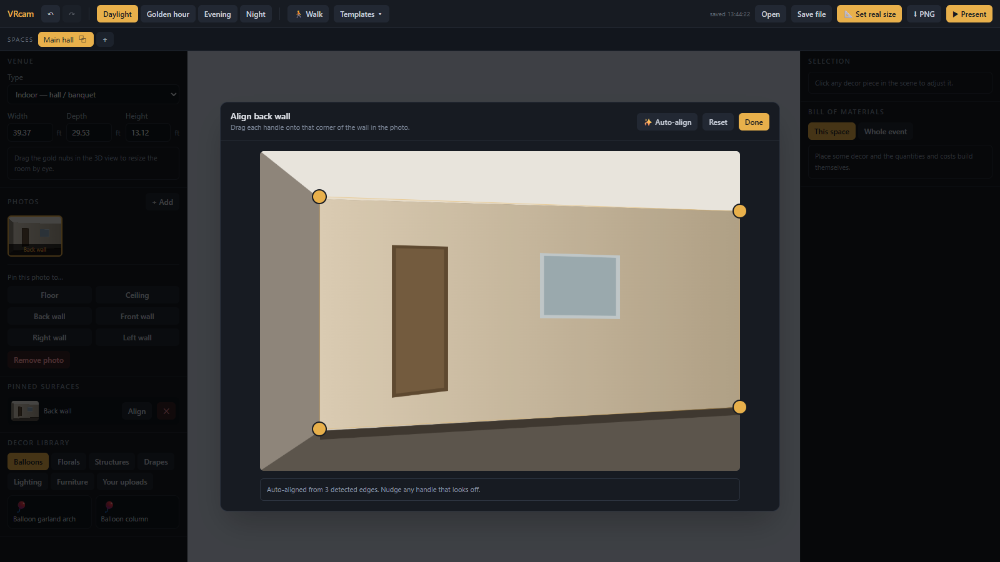
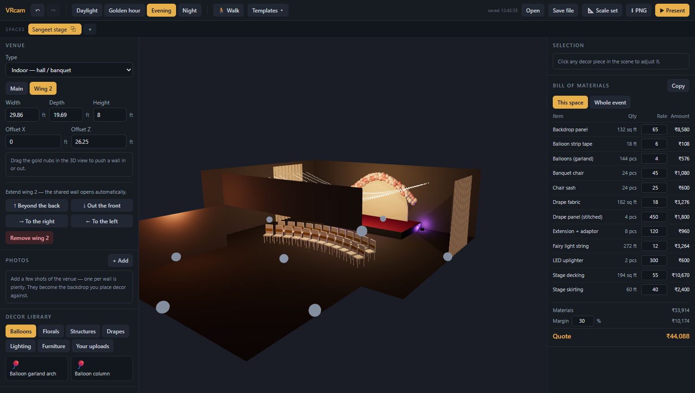
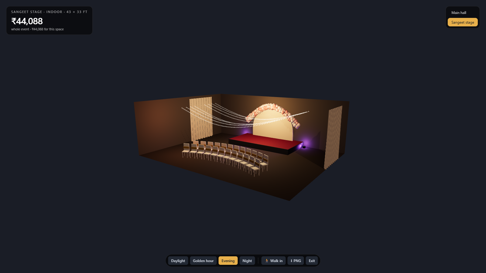

# VRcam

**See the decoration before you build it.**

Photograph a venue on your phone, rough the space out in 3D, dress it with
flowers, balloons, drapes and mandaps, and show the client exactly what their
event will look like — with the bill of materials and the price attached.



---

## The problem

A decorator wins a job by getting a client to picture something that does not
exist yet. Today that means mood boards, hand sketches, or photos of *someone
else's* wedding — none of which show this client's actual hall.

The 3D tools that could solve it do not fit. [Prismm](https://www.prismm.com/)
and [3D Event Designer](https://www.3deventdesigner.com/) start from a
pre-existing floor plan and stock furniture, not your photos and not floral
installations. [Polycam](https://poly.cam/) and Matterport capture real venues
beautifully but need a full walkthrough scan and have no decor tooling at all.
Nobody sells the thing in between.

VRcam is built for the person with the least: a student or newcomer to event
decoration with no floor plans, no LiDAR phone, no CAD training, and a first
client to convince.

## What it does

| | |
|---|---|
| **Any venue, from a photo dump** | Rough out a room, pin your photos to its walls, and correct the perspective by dragging four corners. Auto-align proposes them for you. |
| **Rooms that turn corners** | Extend a wall left, right or forward into an L, T or U. Shared walls open automatically, and each area keeps its own ceiling height. |
| **Decor as a first-class object** | 16 parametric generators — balloon garlands, floral arches, marigold hangings, drapes, mandaps, stages, chair rows, fairy lights — with editable span, colour and density. |
| **A quote, not just a picture** | Every piece reports its own materials, so the bill builds itself: *240 balloons, 18 ft of garland, 6 drape panels.* Rates and margin are editable. |
| **A whole event, not one room** | A project holds several spaces — the haldi lawn, the entrance, the reception hall — each with its own geometry, rolling up into one quote. |
| **Something to actually show** | Full-screen presentation mode, four lighting moods, an eye-height walkthrough, and PNG export. |
| **Works with no internet** | Local-first. Autosaves to your browser, no account, no server. |

## Quick start

```bash
npm install
npm run dev
```

Requires Node 22.12+. No API keys, no environment variables, no backend.

## The workflow

### 1 · Rough the room in

Pick **indoor** (a six-sided box) or **outdoor** (ground plus a backdrop — half
of Indian weddings happen on a lawn). Drag the gold nubs in the 3D view to size
it by eye. You are not drafting; you are getting the proportions roughly right.

### 2 · Pin your photos and straighten them

Assign a photo to a wall or the floor, then drag four handles onto that
surface's corners *as they appear in the photo*. The wall re-rectifies live, so
you are aiming at a result you can see.

**Auto-align** does the first pass — it finds the ceiling line, the floor line
and the room corners, and drops the handles on them. When the wall runs past the
edge of the frame (which is most real photos), it uses the frame edge as the
boundary. When it cannot find a reliable surface, it says so and leaves it to
you rather than guessing.



### 3 · Extend it around a corner

A venue is rarely one clean box. Use the direction pad to extend **left, right,
front or back**, and the new area joins the venue as one continuous space — it
meets the wall edge to edge, and the shared wall opens by itself so you can walk
straight through. Drag a resize nub afterwards to pull one end in and make an L.

Each area keeps its own ceiling height, which is what makes a low entrance foyer
opening into a high hall representable. Where the ceilings differ, the wall above
the opening survives as a transom, exactly as it does in the real building.



### 4 · Set the real size

Give one measurement you actually know — the back wall is 34 ft, the ceiling is
12 ft. Everything scales with it, keeping the proportions you dialled in.

This step is not optional in spirit. You quote garland by the foot, and until
the scene has a real dimension every quantity is a guess. The bill of materials
says so, loudly, until you set it.

### 5 · Dress it

Drag decor in from the library and move, rotate and tune it. Anything missing:
upload a photo of the prop, and it drops into the scene as a background-removed
cutout — instantly, free, and offline.

### 6 · Sell it

**Present** hides every panel and gizmo, leaving the room, a lighting switcher,
the headline price, and one tap to walk the client through each space.



---

## Why it works this way

**Photos never become geometry — and that is deliberate.**

You cannot reconstruct a building from four to six photos. Classical
photogrammetry matches features across images and triangulates, needing
[60–80% overlap with every feature visible in 3+ shots](https://support.pix4d.com/hc/best-practices-for-image-acquisition-and-photogrammetry);
given sparse photos it does not produce a poor model, it fails to solve. Learned
methods ([DUSt3R/VGGT](https://arxiv.org/abs/2507.14798), monocular depth,
room-layout nets) genuinely can produce a rough shell — but they are GPU-bound,
scale-ambiguous to 5–10%, and emit point clouds rather than the flat planes a
decor editor needs.

So the photos are **textures on a hand-adjusted box**. AI proposes, the human
corrects. That correction step is not a workaround for weak AI — it is the
safety net that makes cheap, imperfect AI usable at all, and it is why this
works on a WhatsApp photo dump instead of a survey.

**A venue is a list of rectangles, not one box.** Real halls turn corners, and a
foyer running into a hall has two different ceiling heights. Each wall is treated
as a 1-D interval and the overlap with any adjoining area is subtracted, which is
what opens the doorway between them; where the neighbour is lower, the wall above
the opening survives as a transom. Wings are never rotated — an L, T or U is
fully described by axis-aligned rectangles, and allowing rotation would buy
nothing while making that subtraction far harder.

**Front, back and interior are separate spaces.** A facade shot and an interior
shot share no visible geometry; nothing can register them into one building. So
the unit of work is a *space*, and a project holds several.

**Decor is parametric, not downloaded models.** A balloon arch is instanced
spheres clustered along a curve; a marigold string is beads on a catenary. That
makes colour, span and density editable — exactly what decorators quote on — it
makes the bill of materials fall out for free, and it sidesteps the fact that
CC0 mandap models do not exist.

**Every correction is training data.** When the estimator proposes a quad and
you drag it into place, your final answer *is* the ground-truth label. Those
events are logged locally as `(photo, proposed, final, msSpentAdjusting)` and
export as JSONL. Nothing is trained on yet and nothing leaves the browser —
logging now is the point, because it cannot be collected retroactively.

## Architecture

```
src/
  scene/      Stage, VenueShell, PhotoPlane (GPU homography), DecorItem, WalkControls
  decor/      registry + parametric generators (balloons, florals, structures,
              fabric, lights, furniture, photo cutouts)
  geometry/   estimator (Tier 1 auto-align) + hand-written line detection
  editor/     Toolbar, SpaceTabs, VenuePanel, PhotoWarper, ScaleCalibrator,
              Library, Inspector, BomPanel, PresentBar
  store/      zustand scene store (+ zundo undo), IndexedDB persistence
  lib/        homography solver, background removal, wing geometry + openings
  templates/  four starter scenes
docs/         REQUIREMENTS.md — full spec, market research, roadmap
```

Two pieces are worth knowing about:

**The perspective warp runs in the fragment shader** (`scene/PhotoPlane.tsx`).
The wall's own UV is pushed through a homography uniform, so dragging a corner
re-rectifies at frame rate with true perspective and no per-pixel JS work. A CPU
canvas warp would be affine per triangle and crease down the diagonal.

**Line detection is hand-written** (`geometry/lines.ts`) — Sobel gradients into a
gradient-oriented Hough transform, about 180 lines. Pulling in OpenCV.js would
mean 8 MB of wasm to run an edge filter, a bad trade for a tool that has to work
offline on a mid-range laptop.

**Stack:** React 19, TypeScript, Vite, react-three-fiber + drei (Three.js),
zustand + zundo, Tailwind 4, idb-keyval.

## Deployment

Static SPA — no server, no environment variables, no secrets.

| Setting | Value |
|---|---|
| Build command | `npm run build` |
| Output directory | `dist` |
| Node version | pinned to 22.12.0 via `.nvmrc` |

`public/_redirects` provides the SPA fallback and `public/_headers` sets
immutable caching on fingerprinted assets. Do **not** set `NODE_ENV=production`
as a build variable — `npm ci` would then skip devDependencies, and Vite,
TypeScript and Tailwind all live there.

## Not built yet

- **Share links.** A read-only URL a client can orbit. Needs a backend
  (Supabase Storage + a `/v/:id` route). Projects export and import as JSON today.
- **Tier 2 geometry.** Monocular depth or a layout net on a GPU endpoint, behind
  the existing `geometry/estimator.ts` interface. Only worth paying for if
  auto-align proves insufficient on real photographs.
- **Image-to-3D** for custom props (Meshy/Tripo, ~₹25/model). Cutouts cover the
  long tail for free until this earns its cost.
- **Training on the correction log.** Consent gating must land before any of it
  leaves the browser.

The biggest open question is not a feature — it is whether auto-align holds up
on real venue photographs, with their clutter, blur and wide-angle distortion.
It has only ever been tested against a synthetic image. See
[docs/REQUIREMENTS.md](docs/REQUIREMENTS.md) for the full specification, market
research and roadmap.
